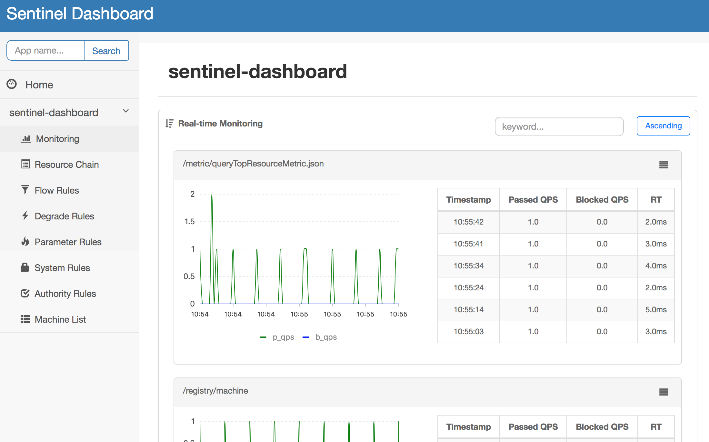
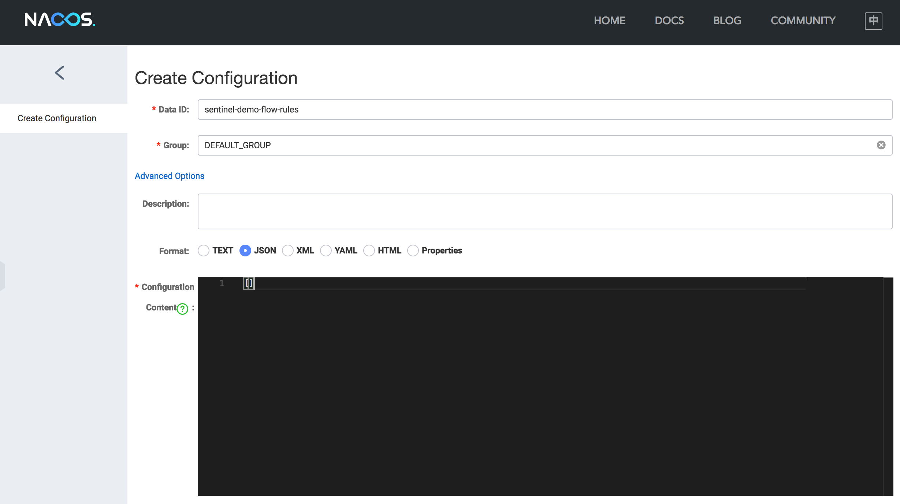
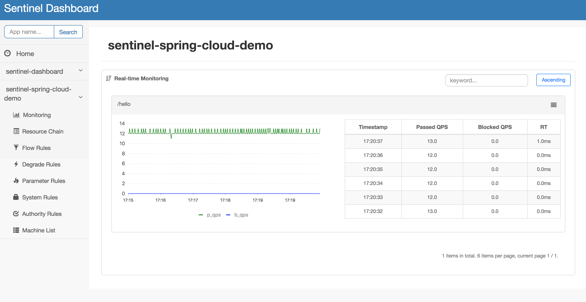
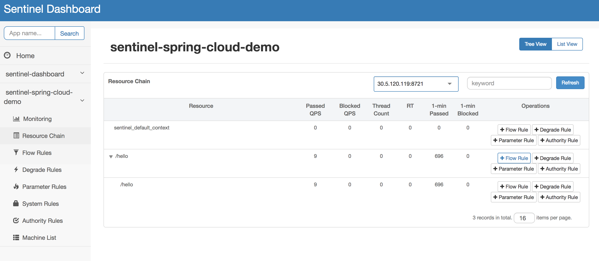
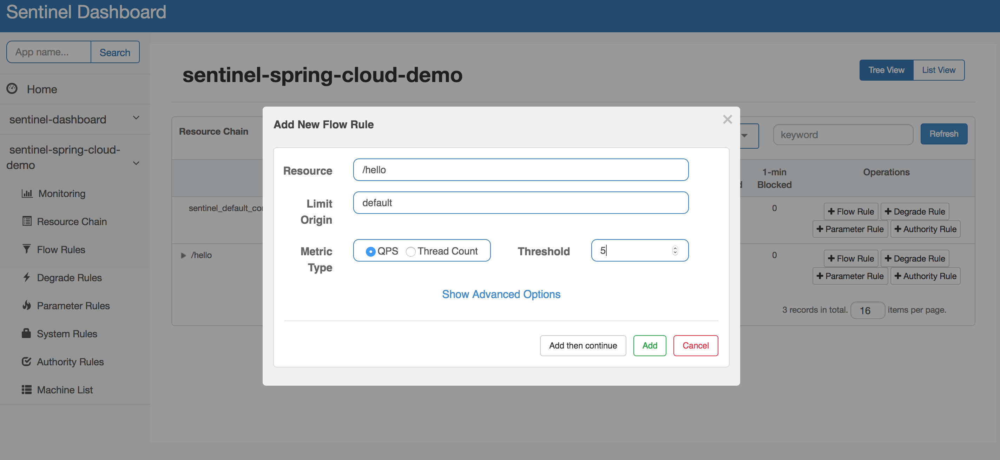
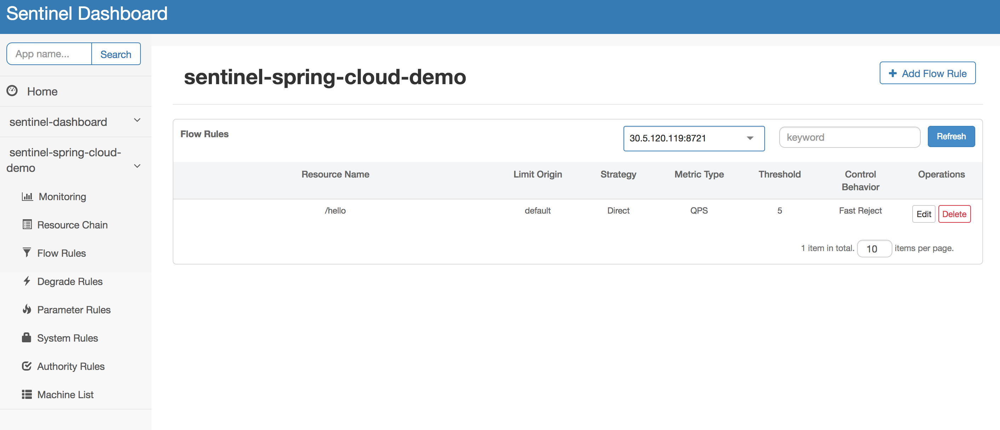
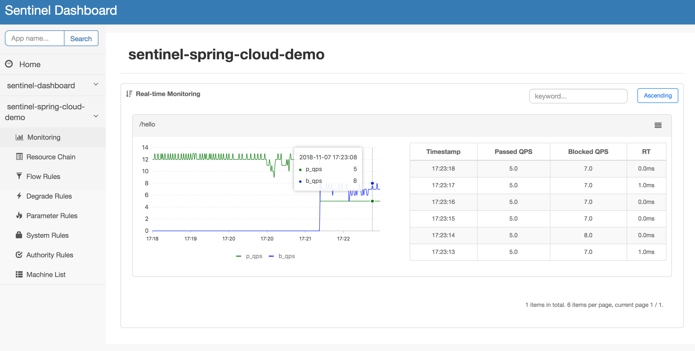
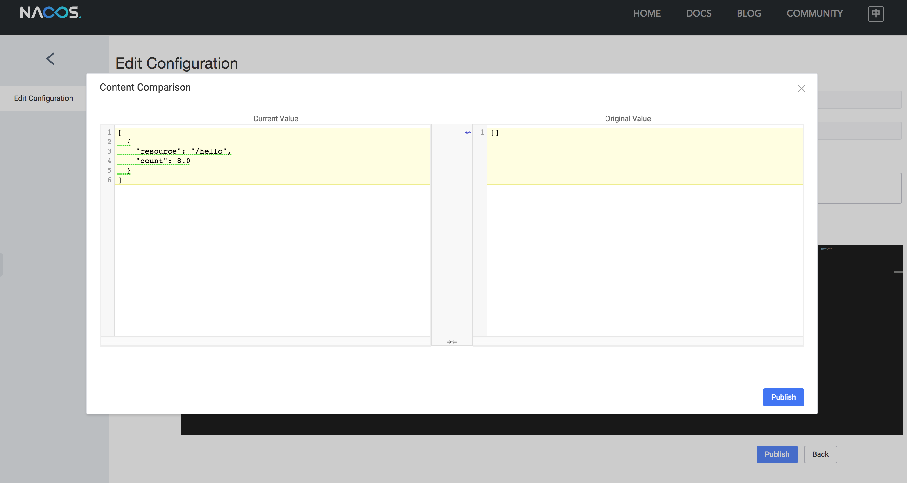
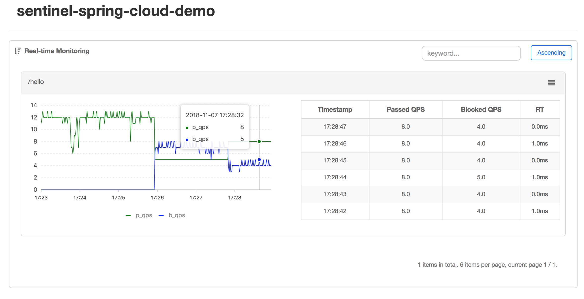

# Spring Cloud Alibaba Sentinel Demo

[Sentinel](https://github.com/alibaba/Sentinel) is a lightweight powerful flow-control component opensourced by Alibaba,
enabling high-availability (flow control, circuit breaking, load protection) and real-time monitoring for microservices.

[Spring Cloud Alibaba](https://github.com/spring-cloud-incubator/spring-cloud-alibaba) provides out-of-box
integration with Sentinel for Spring Cloud applications and services.
This demo will illustrate how to use Sentinel with Spring Cloud Alibaba.

## Start Sentinel Dashboard

We can download the latest Sentinel Dashboard jar here: https://github.com/alibaba/Sentinel/releases/tag/1.3.0

For English version you can choose [sentinel-dashboard-1.3.0-en.jar](https://github.com/alibaba/Sentinel/releases/download/1.3.0/sentinel-dashboard-1.3.0-en.jar).

Then we can start the Sentinel Dashboard from the terminal:

```bash
java -Dserver.port=8080 -Dcsp.sentinel.dashboard.server=localhost:8080 -Dproject.name=sentinel-dashboard -jar sentinel-dashboard-1.3.0-en.jar
```

When it starts successfully, we can visit the dashboard via address http://localhost:8080.
Note that initialization of Sentinel will be triggered when the dashboard is visited for the first time,
so it may take some time to see `sentinel-dashboard` application in the dashboard.

 

## Our simple demo with Nacos datasource

It's very easy to use Sentinel in our Spring Cloud applications.
Just add `spring-cloud-starter-alibaba-sentinel` dependency, then we can configure rules to do flow control for web APIs defined in controllers.

Note that we have to provide dashboard address in `application.properties`,
or our application will not appear in Sentinel Dashboard.

```
# Sentinel related
spring.cloud.sentinel.transport.dashboard=localhost:8080
# Eager initialization
spring.cloud.sentinel.eager=true
```

It's also easy to add a dynamic rule datasource to Sentinel in Spring Cloud Alibaba. For example, we're going to register a Nacos datasource. It just needs 3 steps:

- (1) Add `sentinel-datasource-nacos` dependency:

```xml
<dependency>
    <groupId>com.alibaba.csp</groupId>
    <artifactId>sentinel-datasource-nacos</artifactId>
    <version>1.3.0-GA</version>
</dependency>
```

- (2) Add the datasource config to `application.properties` so that the Nacos datasource can be automatically created and registered to Sentinel.

```
# Sentinel datasource
spring.cloud.sentinel.datasource.type=nacos
spring.cloud.sentinel.datasource.serverAddr=localhost:8848
spring.cloud.sentinel.datasource.groupId=DEFAULT_GROUP
spring.cloud.sentinel.datasource.dataId=sentinel-demo-flow-rules
spring.cloud.sentinel.datasource.converter=flowConverter
```

- (3) Create a config class to bind properties and provide converter:

```java
@Configuration
public class SentinelConfig {

    @SentinelDataSource("spring.cloud.sentinel.datasource")
    private ReadableDataSource dataSource;

    @Bean
    public Converter<String, List<FlowRule>> flowConverter() {
        return source -> JSON.parseObject(source, new TypeReference<List<FlowRule>>() {});
    }
}
```

Now it's ready. We can run the demo to see the effects of flow control in Sentinel.

## Run the demo

First we need to start the Nacos server (see [instruction](https://nacos.io/en-us/docs/quick-start.html)). And push empty flow rule list in Nacos console:

 

Now let's run the demo in IDE. After the demo has been started, we can see our application (`sentinel-spring-cloud-demo`) in Sentinel Dashboard. All machines of the application are listed in **Machine List** page:

 

Then we write a script or using tools (e.g. `ab`) to initiate batch requests to our demo server. An example script:

```bash
while true
do 
    curl -s "http://localhost:18181/hello"
    echo ""
done
```

Now we execute the script or command to initiate requests. We can see the real-time traffic monitoring in **Monitoring** page:

 

All of the invocation resources are showed in **Resource Chain** page:

 

Assuming that our API can only afford 5 QPS, but incoming surge requests are more than the threshold. If we don't take some actions, our service might suffer from high load and fail. So we need to configure flow rules to limit requests to guarantee reliability of our service.

### Configure rules in Sentinel Dashboard

We can manage rules in Sentinel Dashboard directly. Now let's add a flow rule from **Resource Chain** page. Just click "Add Flow" button in the line of target API resource.

Sentinel supports [flow control](https://github.com/alibaba/Sentinel/wiki/Flow-Control) in multiple dimensions (resource granularity, metric type, invocation relationship and traffic shaping effect). In *Add New Flow Rule* dialog, we can choose and configure all of these. Here we simply add a rule limiting the max QPS of our API to 5:



Click "Add" button, then we can see the rule in **Flow Rules** page:

 

The flow rule will take effect immediately. Wait a short time and back to the **Monitoring** page. Now we can see the passed QPS curve has been decrased to 5 visually. Exceeded requests are blocked (the blue curve).

 

For more details of Sentinel Dashboard, please refer to [dashboard document](https://github.com/alibaba/Sentinel/wiki/Dashboard).

> Note: Rules pushed from Sentinel dashboard are stored in memory. If dynamic rule datasource is registered,
the old rules will be replaced by rule changes from datasource.

### Configure rules in Nacos console

If our application consists of plenty of machines (or containers), it's not a good idea to push rules to each machine one by one. 

In production it's common to use config center to store the rules. So usually we can leverage [dynamic rule datasource of Sentinel](https://github.com/alibaba/Sentinel/wiki/Dynamic-Rule-Configuration) in production. Sentinel provides extensions for various config center, e.g. Nacos, ZooKeeper and Redis.

Now let's configure the rules in Nacos console. After pushing the rules to Nacos, all instances will receive the updated rules.

We choose the entry of groupId `DEFAULT_GROUP` and dataId `sentinel-demo-flow-rules` and click "Edit". In the *Edit Configuration* page, we change the rule content to the following list:

```json
[
  {
    "resource": "/hello",
    "count": 8.0
  }
]
```

This rule represents flow control for resource `/hello` (our web API), limit max QPS at 8.

 

Click "Publish" button to publish the configuration. We can notice that old rules have been replaced by new rules in Sentinel rule page:

 

Now let'g go back to the **Monitoring** page. We can see that QPS has increased visually, and is stable at 8:

 